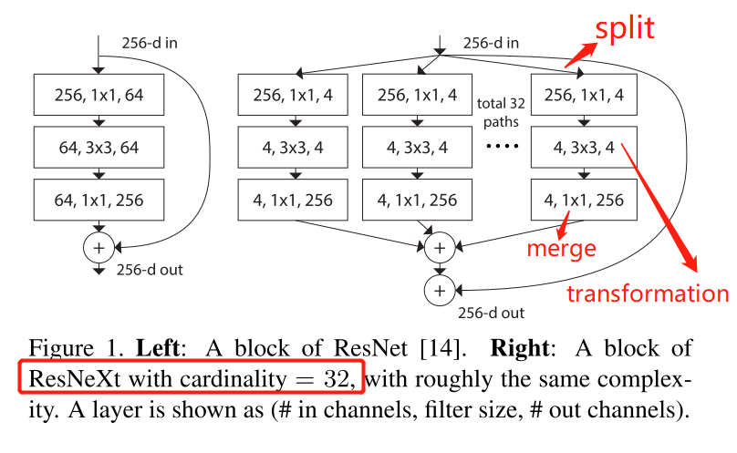
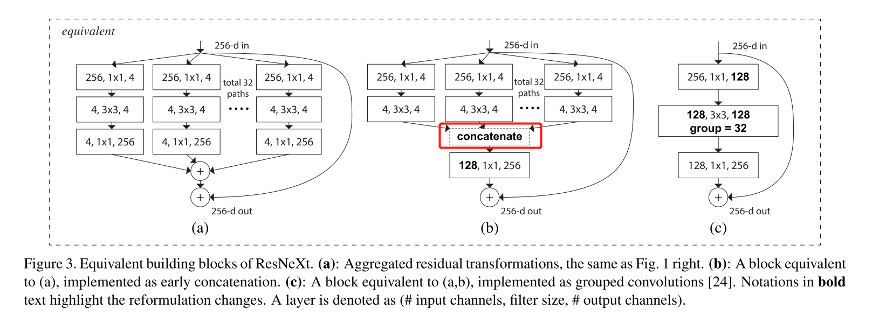

论文: [Aggregated Residual Transformations for Deep Neural Networks](http://openaccess.thecvf.com/content_cvpr_2017/papers/Xie_Aggregated_Residual_Transformations_CVPR_2017_paper.pdf)

github: [https://github.com/facebookresearch/ResNeXt](https://github.com/facebookresearch/ResNeXt)

### 1. Abstact
1. ResNeXt, 指的是网络width/depth等维度外的next维度，即文中所述的cardinality，而这个cardinality指的则是每个ResNeXt模板结构中的transformation的个数（见下述）；
2. 该文主要还是在围绕两点展开：
    * 堆砌网络层，参考VGG、ResNet等
    * 继续探索split-transformation-merge策略，该策略在Inception网络结构中出现

3. 网络结构一览
    * ResNeXt中block展示
        
    * 由上图中标记所示，这里split-transformation-merge策略与Inception的不同在于，本文的所有这些模块，其结构都是一样的，而Inception则不同（比如，InceptionV1中分别包含1x1, 3x3, 5x5, MaxPool等不同的transformation方式）; 
    * 将每个模块结构保持一致，其优势在于，这样可以将这样的模块的个数独立作为一个factor来判断其对网络性能的影响（即文中提出的cardinality维度）

### 2. Details

#### 2.1 split-transformation-merge策略
1. 如文中3.2所述，split-transformation-merge可以表述为（具体表现如上图中所示）：
    * split：slice input vector into low-dimensional embedding. 
    * transformation：transform low-dimensional respresentation，这里在文中的对应的操作就是对上一层的网络执行3x3的卷积操作
    * merge: aggregate all transfromations in all embedding. 使用element-wise sum以保证输入输出维度不变

#### 2.2 cardinality维度
1. cardinality指的就是split-transformation-merge策略中transformation的个数，上图中所示是cardinality=32等情况
2. 对于增加cardinality维度，其优势在于其能够在增加网络accuracy的同时不增加网络的参数；而对accuracy的提升，如作者所述，在于通过增加cardinality的能够学习到更好的特征表达（transformation变多了，相当于执行更多的卷积操作）
3. 一般情况下，提升网络性能可以通过让网络变深(deeper)或变宽(wider)，而作者在实验中对比了增加cardinality和going deeper/wider分别对性能的影响，发现增加cardinality是能够比让网络going deeper/wider获取更好的结果的
4. 这个cardinality其实很像group convolution，而作者在实际就是用的torch中内嵌的group convolution操作实现的，可以参考下图
    * 
    * 图中可见，三种方式的不同，一是在于merge的位置，而merge是用element-wise的方式进行的，另一方面是不同transformation的实现方式（c中用group conv实现）
    * 这三种方式等价的理论证明，作者给出了简要证明，即等式A1B1 + A2B2 = [A1, A2][B1; B2])

