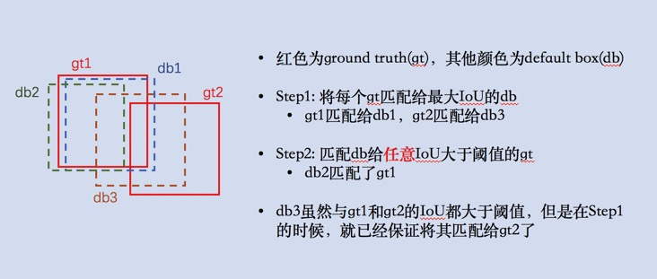
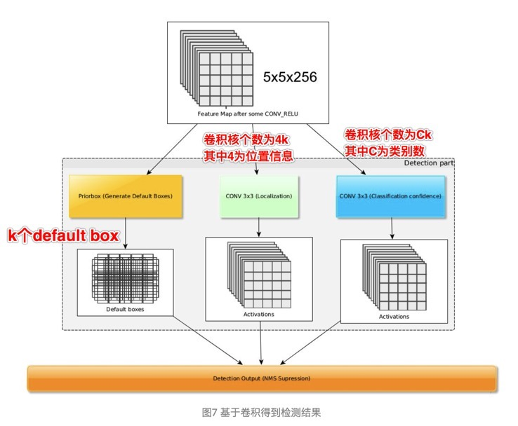

paper: [Single Shot MultiBbox Detector](https://arxiv.org/abs/1512.02325)

code: [https://github.com/weiliu89/caffe/tree/ssd](https://github.com/weiliu89/caffe/tree/ssd)

SSD作为经典的one-stage的目标检测方法，已经被广泛证明其有效性。学习工作中也用到过很多次，这里不再系统对其展开，只按照相应的知识点进行回忆记录。

#### 思想
在网络的不同阶段的feature map上产生不同aspect rations和scale的default boxes作为目标的候选框，并按照一定的规则对default box进行match，生成所需的训练样本进行训练；最终预测出，给定图像中目标的location和category confidence score

#### 多尺度的feature map
如下以SSD300为例展开

1. 共筛选了哪些尺度的FM？
    * SSD以VGG-16作为网络的backbone
    * 分别选用VGG-16的6个不同阶段（即不同尺度）的feature map，并对每个阶段的feature map设置不同的default box个数，即conv4_3(38\*38, 4 bboxes), conv7(19\*19, 6 bboxes), conv8_2(10\*10, 6 bboxes), conv9_2(5\*5, 6 bboxes), conv10_2(3\*3, 4 bboxes), conv11_2(1\*1, 4 bboxes)
        * 最终每一个class对应的default box为：8732个，即(38\*38+3\*3+1\*1)\*4+(19\*19+10\*10+5\*5)\*6
        * 因此，可以说SSD是密集采样

2. 如何将这些FM结合到一起？
    * permute + reshape + flatten + concate

#### Default bbox(anchor box)
Default box类似于fast-rcnn系列中的anchor box，主要关注如下几点

1. 对于某一层，如何产生default box？
    * 对于某一层，假设其尺寸为M\*N，则可以将其分为M\*N个cell，在每个cell上按照不同的aspect ratios和scales产生k个bbox，则该层总共可以产生M\*N\*k个；前面提到的SSD300最终每个类别输出8732个default bbox就是如此计算的（即：每一层的k是一致的，不同层可能会不一样）

    * 对于每个default bbox，其保护有location和confidence score两类信息，其中前者长度为4（cx, cy, w, h），后者长度为c（即类别数），因此每个default bbox的输出维度为c+4
    * 对于M\*N的feature map，其输出为(c+4)\*k\*M\*N

2. 如何自适应的产生不同尺度的FM中的default box？
    * 上一步只说明了每一个所选择的特征层中每个cell设置的default box个数，但是具体生成的default box的size如何，没有具体阐述（即上述不同的aspect ratios和scales如何产生）
    * *scale*，假设有m个fm用来做预测，则每一层的default box的scale按如下公式计算：
        * 
        * 其中最小和最大值表示最底层的scale为0.2，最高层的scale为0.9，而在此之间的层，其scale则按上述公式生成
        * 这里scale是相当于原图的，以实际选取的6个特征图为例
            * 第一层特征（conv4_3），scale比例为0.2，则该层的**实际尺度**为300\*0.2=60
            * 第二层特征（conv7），scale为0.37，该层的**实际尺度**为300\*0.37=111
            * 第三层特征（conv8_2）, scale为0.54， 该层的**实际尺度**为300\*0.54=162
            * 以此类推，如果不考虑aspect ratio，最后所有的fm的实际尺度为60，111，162，213， 264
    * *aspect ratio*，对每个default box采用不同的aspect ratio(宽高比)，aspect ratio类别有:
        * 
    * 有了scale和aspect ratio后，每个default box的中心点和宽高为:
        * 中心点: 
        * 宽高（公式计算的结果是相对于原图的比例）: 
        * 当aspect ratio是1时，添加一个默认的default box，其scale为: 
        * 因此，每个fm的cell能够产生供6个不同default box，实际实验中，conv4_3, conv10_2, conv11_2都只有4个default box（如上文所述）

3. 如何对default box打标签？
    * 如上阐述了如何产生不同尺度下的default box，而在训练阶段，需要对每个default box打标签，之后才能backward计算loss
    * 首先说明一点，**对于给定的图像中存在的所有目标的所有ground truth，都可以在进行卷积计算的过程中映射到对应层的特征图的位置上**，TODO
    * 对于当前层的feature map，每个default box只能匹配一个ground truth（因为是要给default box打标签，计算loss的，如果一个default box有多个标签，相当于一个object有多个标签，便产生歧义了；但是，一个ground truth可以匹配多个default box），具体匹配策略如下：
        * 首先，将gt匹配给与其IoU最大的default box（这样会使得一部分default box与gt有一定的IoU，但是却没有匹配）
        * 其次，对没有匹配到gt的default box，将其匹配给与其IoU大于一定阈值的**任意gt**（如此，解决了上一步的问题）
        * 这个顺序很有意思，能够保证每个default box只有一个匹配的gt，而一个gt则可能存在多个匹配的default box（但是这一点是可以的），如下图示
        * 
    * 按上述方法，匹配到gt的default box就用gt的标签作为其类别信息，即正样本，其他的则为负样本

    * 由于匹配后，一张图中实际的正样本数会远远小于负样本数目（一张图中，目标相对背景总是少数的）；因此为保持保证正负样本的均衡，采用**hard negativate mining**技术将正负样本的比例保持为3:1
        * 对负样本按照预测的置信度得分进行排序，选中top-k作为实际用于训练的负样本（负样本的置信度越小，表示是背景的概率越小，误差越大）

4. 如何筛选default box准备训练集？
    * 对default box打标签参考上面的表述
    * 实际实验中，作者有采用了**data augmenttation**，即对每张原始图像随机执行这些操作: 随机水平翻转，随机裁剪，随机采集patch，随机扩充，颜色变化等

5. 训练过程
    * 训练过程，整体流程如下图所示(图例来源[SSD训练流程][SSD训练流程]):
        * 
    * 即：对于用于提取特征的层，以conv4_3为例(512\*38\*38)，k为4，c为21（VOC数据）
        * 对loc信息，用16个3\*3\*512的卷积对其进行conv操作，得到16\*38\*38个输出
        * 对category信息，用84个3\*3\*512的卷积对其进行conv操作，得到84\*38\*38个输出
        * 将loc和category对应的卷积输出分别进行permute（从NCHW变为NHWC），flatten(变为23104)
            * 这里使用permute操作，是为了更方便将不同层的结果结合到一起（最后输出的C代表的是）见下图
                * 
        * 将所有特征层的loc和category分别进行concat操作，得到mbox_loc和mbox_conf
    * 与此同时，每个要提取的特征层也会产生对应的default box，将所有的default box也concate到一起（这个值和上面说的mbox_loc和mbox_conf的维度是一致的，因为每个default box只有loc和category共5个数据）
    * 计算每个预测的框与gt之间的loss，使得预测的框能够逐渐逼近gt
        * 这里会对gt数据进行编码的，将default box信息编码进来（网络的最终测试过程输出的loc是相对于default box的offset）

6. 预测过程
    * SSD采用小的卷积直接输出检测结果，具体如下(图例来源[知乎][知乎])
        * 
    * 将网络的预测结果（相对于default box的offset），结合default box，解码出预测的目标位置和类别

#### Loss
1. loss见下图
    * 
    * location的loss只对正样本计算，gt的box的中心点（gt中心点相对**default box**中心点的offset在原图的比例）、宽高都是映射的比例值（宽高相对**default box**宽高的比例）
    * 使用SmoothL1的好处，可以参考[L2/L1/SmothL1 loss对比][L2/L1/SmothL1 loss对比]

#### 为何SSD有效？为何多尺度特征有效？
1. 选择不同尺度的feature map用于后续预测，满足了多尺度的特征
2. 对每个feature map又选择了多个不同比例和缩放尺度的default box（涵盖了不同尺寸的目标），相当于每个fm上采样多次，整体的多个fm上就完成密集采样
3. 当然，SSD还是对小目标的检测效果会有所降低（主要还是采样的default box限制了）

----

[知乎]: https://zhuanlan.zhihu.com/p/33544892 "zhihu"
[L2/L1/SmothL1 loss对比]: https://www.zhihu.com/question/58200555/answer/621174180
[SSD训练流程]: https://www.cnblogs.com/xuanyuyt/p/7222867.html#_label1

