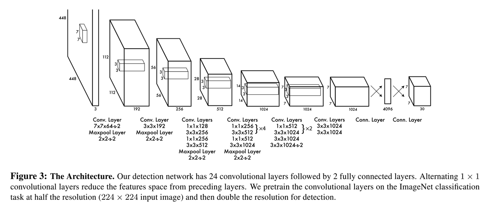

## Yolo V1
paper: [You Only Look Once: Unified, Real-Time Object Detection](http://arxiv.org/abs/1506.02640)

slide：[官方slide介绍，很详细](https://docs.google.com/presentation/d/1aeRvtKG21KHdD5lg6Hgyhx5rPq_ZOsGjG5rJ1HP7BbA/pub?start=false&loop=false&delayms=3000&slide=id.p)

### Abstract
1. 如文章名字所述，其完成一次目标检测，只需要look once，也就是不像两阶段的网络那样，也不像SSD那样，需要提前生成anchor bbox/default bbox
2. 网络计算特别快，主要是因为需要搜索的目标框的个数不多，如文中所述，对于7x7的cell，每个cell预测2个bbox，最终的总共框的个数也就98个，相对于SSD或Faster RCNN这些，少了很多。网络的模型如下图：
    * 

### Details
1. 原理
    * yolo v1是用CNN直接回归出目标的bbox，不需要生成anchor bbox
    * 对于一张图，将其分为SxS个cell，每个cell预测B个bbox，每个bbox携带[x,y,w,h,confidence]五个信息，同时网络还预测输出该bbox属于C类的概率（对于VOC，S是7，B是2，C是20）
        * 这里所说的*SxS个cell，每个cell预测B个bbox*，并不是对图像的真实操作，而是以网络的输出来体现的，即最后一层网络输出`7x7x(5x2+30)`维的数据。
            * 这一点有点抽象，对于网络最后的输出，前10个为第一个cell的值，而其体现是第一个cell的方式可以这样解读：在训练计算loss时，因为是认为网络输出的坐标值是和cell编码的（见下一条阐述），所以，训练样本的label就需要*映射*到对应的cell中，然后再去和网络输出计算loss，这样如果输出值和映射后的label相差较大，也就是loss会大，相对于惩罚越大，接下来迭代时就会偏向于预测的值和映射后的gt更相近的地方。
        * x和y是相对于每个cell编码的偏移，w和h是相对于原始图像编码的，confidence是当前cell存在目标与否的概率P与bbox和gt的IoU的乘积，即如果cell没有目标，则P=0，confidence=0，如果有目标，则P=1，confidence=IoU
        * 目标概率，相对于只和有目标存在的cell有关。**而且，每个cell不管预测多少个bbox，都是只预测一组C类的概率**，也就是为什么每个cell的输出是`5x2+20`，因为属于20个目标类别的概率是依赖于cell，而独立于bbox的

2. loss函数
    * 网络的loss是回归的loss和分类的loss的加权组合，由于一张图中大部分cell都是没有目标的，所以如果回归的loss和分类的loss等价的话，会导致不含有目标的cell的分类loss占据主导，不利于模型的稳定性，因此，引入两个权重因子，回归的loss权重为5，**没有目标的分类的loss**权重为0.5，而含有目标的cell的分类loss权重依然为1
    * 同时，w和h是开方之后计算的，以消除大尺寸框和小尺寸框的差异；如果不开方，则loss会趋向于拟合大尺寸的框
    * 对于回归的loss，只有该bbox属于该gt时才会计算（见loss函数的前两项）
    * 对于分类的loss，只有该cell存在bbox时才会计算（见loss函数的最后一项）
    * 

3. 如何准备数据标签？如何训练？
    * 训练数据是VOC的数据格式，只是在计算loss时会做编码处理
    * 网络结构如下图
        * 
    * 训练时原模型是ImageNet是预训练，然后增加多个`1x1`的卷积层，并将尺寸扩大到`448x448`

4. 测试时的网络输出是什么？
    * 每张图输出98个bbox，网络的最后两层是FC，然后reshape到`7x7x30`，依次存储的是每个cell的[x,y,w,h,c]，最后的20位是分类的概率信息
    * 对于网络中，一个较大的物体，可能会被多个cell预测出来多个框的情况，用NMS过滤
    * 前向计算时，使用物体的类别预测最大值p乘以预测框的最大值c，即将类别预测值和IoU相乘，作为输出预测物体的置信度，这样能够尽可能适配到多个比例的目标，同时能够过滤到不少重叠的框（因为有IoU），见上面参考slide的第25页

5. 缺点？
    * 对于密集的目标、小目标不好
    * 对于新的长宽比的目标效果不好（SSD这些有anchor bbox，能够覆盖更多不同类型的目标）

## Yolo V2